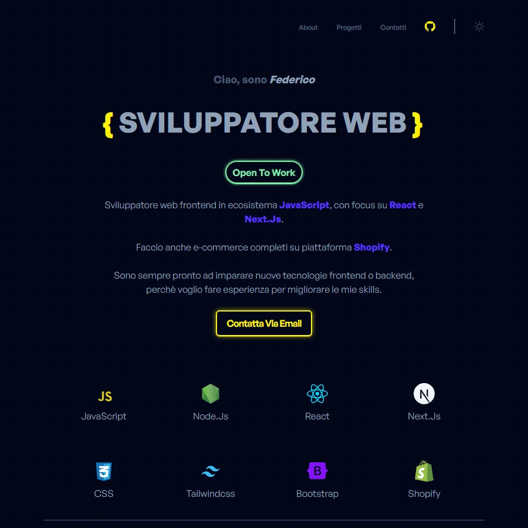

# Porfolio

La mia attuale pagina portfolio, fatta interamente da zero con CSS e JavaScript, senza framework o librerie. Alcune features:

- **Mobile first** e **responsive** con sei media query basate sui container delle sezioni;
- **Lazy loading** delle immagini (JavaScript)
- **Lightbox** per visualizzare le immagini (JavaScript)
- **Theme switcher (dark/light mode)** con manipolazione DOM, gestione state e IntersectionObserver (JavaScript)
- **Navbar animata** (JavaScript)
- **Back to top button dinamico** (JavaScript)
- **Email obfuscation** (JavaScript) 
  ...e un piccolo **minigioco segreto** 😉
   

Potete vederlo qui: [Portfolio](https://portfolio-federico-vigano.vercel.app/)

<!-- Home link e img -->

Fatto con ❤️ da un essere umano.
